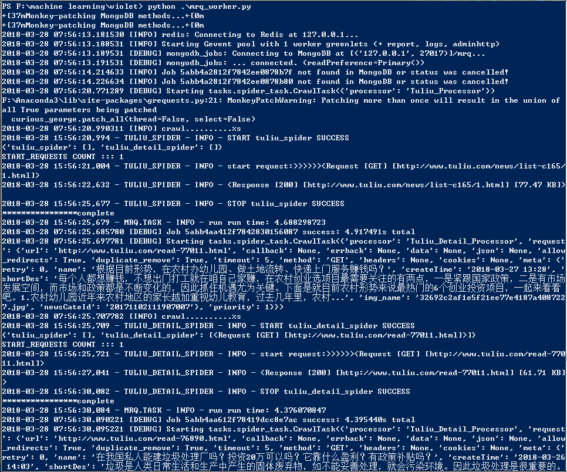

# AcgNewsCrawler
整合```mrq```和```fetchman```为分布式的爬虫实现

### 原项目
- **[fetchman](https://github.com/DarkSand/fetchman)**

- **[mrq](https://github.com/pricingassistant/mrq)**


### 依赖环境
> 依赖环境即需要```pip```安装的包等，请依照原项目自行安装。


### 示例
1.在```processors```文件夹下面新建一个继承```BaseProcessor```的自定义```processor```，例如```tuliu_processor.py```:

``` python
# 首页的处理器
class Tuliu_Processor(BaseProcessor):
    spider_id = 'tuliu_spider'
    allowed_domains = ['tuliu.com']

    # 推入初始request
    @classmethod
    def init_start_requests(cls):
        cls.start_requests.extend([Request(url='http://www.tuliu.com/news/list-c165/%s.html' % page, priority=0,
                                           meta={'newsCateId': '20171102111907007'}) for page in range(1, 2)])
        # cls.start_requests.extend([Request(url='http://www.tuliu.com/news/list-c163/%s.html' % page, priority=0,
        #                                    meta={'newsCateId': '20171102111907007'}) for page in range(1, 30)]

    @check
    def process(self, response):
        soup = bs(response.m_response.content, 'lxml')

        tuliu_div_list = soup.select('div.news_list_list ul li.list_box')
        detail_processor = Tuliu_Detail_Processor()
        for tuliu_div in tuliu_div_list[:3]:
            if tuliu_div.select('a img'):
                detail_url = tuliu_div.select('a')[0]['href']
                img_url = tuliu_div.select('a img')[0]['src']
                name = tuliu_div.select('h1.category_title nobr.l')[0].text.strip()
                createTime = tuliu_div.select('h1.category_title nobr.r')[0].text.replace('发布时间 ', '').strip()
                shortDes = tuliu_div.select('div')[0].text.replace('[查看全文]', '')

                md5 = hashlib.md5()
                rand_name = str(time.time()) + str(random.random())
                md5.update(rand_name.encode("utf8"))
                img_name = md5.hexdigest() + '.jpg'

                request = Request(url=detail_url, priority=1)
                request.meta['name'] = name
                request.meta['createTime'] = createTime
                request.meta['shortDes'] = shortDes
                request.meta['img_name'] = img_name
                request.meta['newsCateId'] = response.request.meta['newsCateId']
                d = request_to_dict(request, detail_processor)
                # 递送出新的crawl任务， 即新的爬虫实例
                # 如果希望在本爬虫实例中继续请求进行爬取操作，请yield出Request实例
                yield Violet(Tuliu_Detail_Processor, d)

# 详情页的处理器
class Tuliu_Detail_Processor(BaseProcessor):
    spider_id = 'tuliu_detail_spider'
    allowed_domains = ['tuliu.com']

    # 获取新闻详情并丢入DataBasePipeline
    @check
    def process(self, response):
        soup = bs(response.m_response.content, 'lxml')
        result = dict()
        result['newsProductId'] = time.strftime('%Y%m%d%H%M%S', time.localtime(time.time()))
        result['newsCateId'] = response.request.meta['newsCateId']
        result['name'] = response.request.meta['name']
        result['imageUrl'] = response.request.meta['img_name']
        result['newsCateId'] = response.request.meta['newsCateId']
        result['shortDes'] = response.request.meta['shortDes']
        result['createTime'] = response.request.meta['createTime']
        result['newsFromWebUrl'] = response.request.url
        span_list = soup.select('div.article-header p.text-gray-9 span')
        for span in span_list:
            if '来源：' in span.text:
                result['newsFrom'] = span.text.replace('来源：', '').strip()
                break
            else:
                result['newsFrom'] = '互联网'
        longDes = soup.select('div.article-content')[0]

        result['longDes'] = str(longDes)
        # 递送出新的pipeline任务
        yield PipeItem([CONSOLE_PIPELINE], result)

```

2.新建一个```main.py```，里面书写启动的主要代码:
``` python
if __name__ == '__main__':
    # res = no_queue_task({"processor": Tuliu_Processor.__name__})
    # 启动初始化任务
    res = queue_job(CRAWLER_TASK, CrawlArgs(Tuliu_Processor), queue=CRAWLER)
    print(res)
```

3.打开命令行运行目录下的```python mrq_worker.py```，即接收队列中派送出来的任务，并执行任务。

> 默认情况下的配置从```mrq-config.py```中读取。

4.另起一个命令行运行目录下的```python main.py```。执行任务的分发，将任务分发到消息队列中。


5.运行目录下的```python mrq_monitor.py```开启网页监控，进入```http://localhost:5555```查看。


